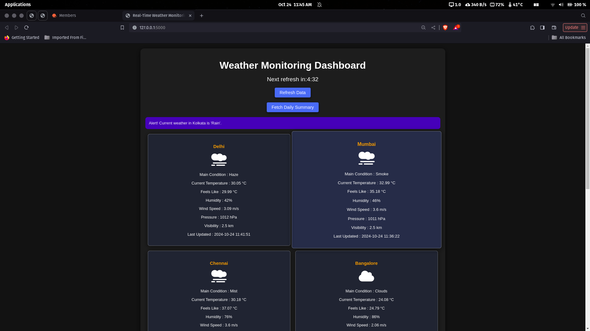
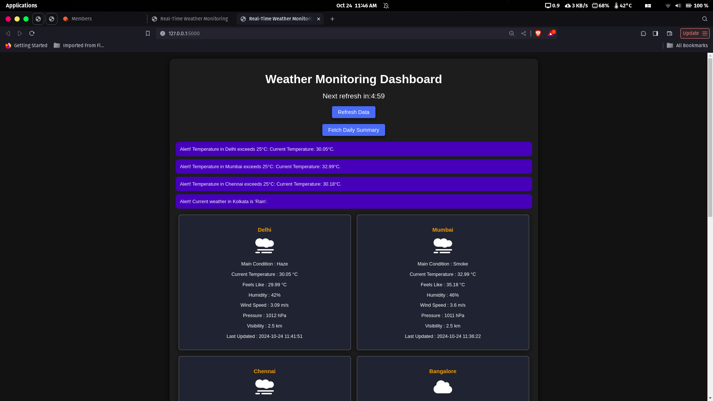
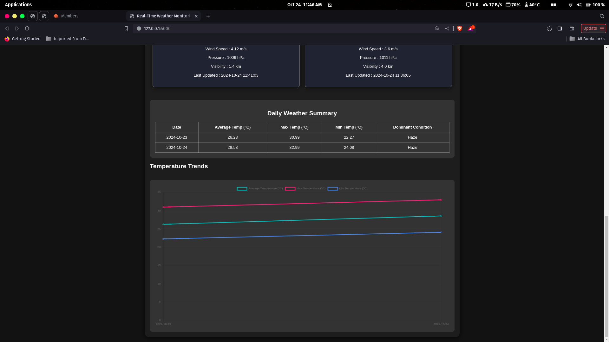

# Real-Time Weather Monitoring System

## Overview
The Real-Time Weather Monitoring System is a web application that provides users with real-time weather updates, alerts, and historical weather data for multiple cities. Built using the Flask framework and integrated with the OpenWeatherMap API, this application enables users to monitor weather conditions efficiently.

## Features
- **Real-Time Weather Updates**: Automatic weather updates every 5 minutes for a predefined list of cities.
- **Alerts**: Customizable thresholds for temperature and weather conditions with real-time alerts.
- **Daily Weather Summary**: Aggregated daily weather data stored in a SQLite database, showing average, maximum, and minimum temperatures.
- **Data Visualization**: Graphical representation of temperature trends over time using Chart.js.
- **User-Friendly Interface**: Intuitive dashboard with weather summaries, alerts, and refresh options.
- **Manual Refresh**: Users can manually refresh weather data at any time.
- **Responsive Design**: The application is designed to work seamlessly on various devices.

## Installation

1. Clone the repository:
   ```bash
   git clone https://github.com/RAJPOWELL/Weather-Monitoring-with-Rollups-and-Aggregates.git
   cd weather-monitoring-system
   ```

2. Install the required dependencies:
   ```bash
   pip install -r requirements.txt
   ```

3. Update the API key in `app.py`:
   Replace `API_KEY = 'your_api_key'` with your OpenWeatherMap API key.

4. Run the application:
   ```bash
   python app.py
   ```

5. Open your web browser and navigate to `http://127.0.0.1:5000`.


## Using Docker

1. Build the Docker image:

   Make sure you are in the project directory where the Dockerfile is located, then run:

   ```bash
   docker build -t weather-monitoring-app .
   ```
2. Run the Docker container:

   Run the following command to start the container:

   ```bash
   docker run -d -p 5000:5000 weather-monitoring-app
   ```

3. Access the application:

   Open your web browser and go to http://localhost:5000 to view the app.

## Screenshots
### Dashboard


### Alerts


### Daily Weather Summary


## Database Schema
The application uses a SQLite database named `weather.db`. The database schema is defined as follows:

### Table: `daily_weather`

| Column Name          | Data Type  | Description                                 |
|---------------------|------------|---------------------------------------------|
| `date`              | TEXT       | The date of the weather record (Primary Key) |
| `avg_temp`          | REAL       | The average temperature for the day (°C)   |
| `max_temp`          | REAL       | The maximum temperature for the day (°C)   |
| `min_temp`          | REAL       | The minimum temperature for the day (°C)   |
| `dominant_condition`| TEXT       | The most common weather condition for the day |

## Technologies Used
- **Backend**: Python, Flask
- **Frontend**: HTML, CSS, JavaScript (with Chart.js)
- **Database**: SQLite
- **API**: OpenWeatherMap API for fetching weather data

## Acknowledgments
- [OpenWeatherMap](https://openweathermap.org/) for providing the weather data API.
- [Flask](https://flask.palletsprojects.com/) for the web framework.
- [Chart.js](https://www.chartjs.org/) for data visualization.

